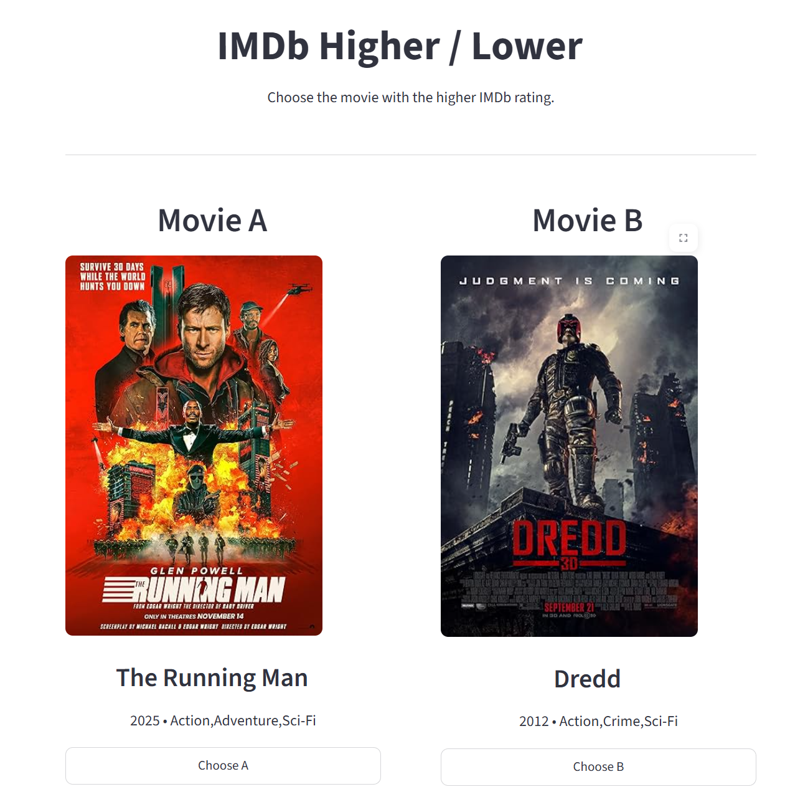
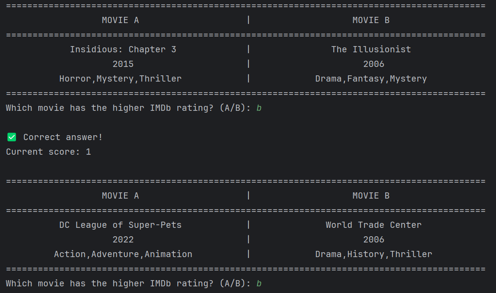

# Imdb Higher / Lower
Movie guessing game built with Python and Streamlit using imdb datasets.

## Project steps
Project was build in 3 steps

### imdb dataset

- load imdb datasets
- clean and filter data we want to use ( only movies , 50k votes + and made from 2000 +)
- export to csv

### Terminal version

- play in terminal
- compare 2 random movies
- track score

### Streamlit web app

- interactive browser game
- poster via OMDb API
- session state managment

## Project Structure

```
IMDb_project/
│
├── app/
│   └── app.py
│
├── data/
│   ├── imdb_cleaned_movies.csv
│   ├── title.basics.tsv.gz
│   └── title.ratings.tsv.gz
│
├── scripts/
│   ├── prepare_dataset.py
│   └── terminal_play.py
│
└── README.md
```

## Screenshots

### Web app


### Terminal



